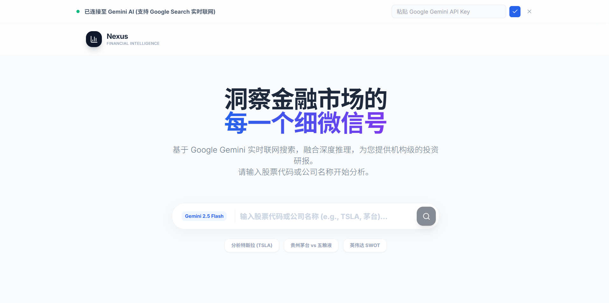

# Nexus - AI 金融分析平台


## 项目简介

Nexus 是一款基于人工智能的金融分析平台，利用 Google Gemini API 提供实时、全面的公司财务分析与投资决策支持。平台能够自动收集市场数据，生成深度分析报告，包括投资评级、SWOT分析、财务指标对比等关键信息，帮助投资者做出更明智的决策。

### 应用界面预览



> 上图展示了 Nexus 智能投研应用的实时分析界面，包含完整的用户界面和功能展示

## 主要功能

- **实时金融数据分析**：通过 Gemini API 获取最新市场数据
- **智能投资评级**：AI 驱动的 BUY/HOLD/SELL 投资建议
- **SWOT 分析**：全面评估公司优势、劣势、机会与威胁
- **同业对比**：与行业竞争对手关键财务指标对比
- **财务趋势可视化**：图表展示关键财务数据趋势
- **AI 思维链展示**：透明化 AI 分析过程与推理逻辑
- **多维度报告展示**：核心概览、SWOT分析、同业对比三个维度的详细报告

## 技术栈

- **前端框架**：React
- **图表库**：Recharts
- **图标库**：Lucide React
- **AI 服务**：Google Gemini API
- **样式方案**：Tailwind CSS 
- **构建工具**：Vite 

## 项目结构

```
Nexus/
├── components/          # React 组件
│   ├── ProcessVisualizer.tsx  # 处理过程可视化组件
│   └── ReportDisplay.tsx      # 报告展示组件
├── services/            # 服务层
│   └── geminiService.ts       # Gemini API 服务
├── types/               # TypeScript 类型定义
├── public/              # 静态资源
├── .env.local           # 环境变量配置
└── README.md            # 项目文档
```

## 核心组件

### ProcessVisualizer

负责展示 AI 分析过程的可视化组件，提供实时的分析状态更新和步骤展示，支持取消操作和重新开始分析。

### ReportDisplay

核心报告展示组件，包含三个主要标签页：
- **核心概览**：展示投资评级、关键财务指标和趋势图表
- **SWOT分析**：可视化展示公司的优势、劣势、机会与威胁
- **同业对比**：与竞争对手的财务数据对比表格

同时支持 AI 思维链展示，让用户了解分析过程。

## 核心服务

### geminiService

封装了与 Google Gemini API 的交互逻辑，提供金融分析报告生成功能，包括：
- 实时数据获取（通过 Google Search）
- 结构化报告生成
- 数据来源追踪
- 错误处理与降级方案（模拟数据）

## 开发与部署

### 本地开发

**前置条件**：Node.js

1. 克隆仓库：
   ```
   git clone https://github.com/hhhh124hhhh/Nexus.git
   cd Nexus
   ```

2. 安装依赖：
   ```
   npm install
   ```

3. 配置环境变量：
   - 复制 `.env.example` 文件为 `.env.local`：
   - `cp .env.example .env.local` (Windows: `copy .env.example .env.local`)
   - 在 `.env.local` 文件中设置 `GEMINI_API_KEY=您的Gemini API密钥`

4. 启动开发服务器：
   ```
   npm run dev
   ```

### 构建与部署

```
# 构建生产版本
npm run build

# 预览生产构建
npm run preview
```

## API使用示例

项目包含了详细的API使用示例文件，位于 `api_example.ts`，展示了如何：

- 基本公司分析调用方法
- 多家公司竞争对手比较分析
- 自定义分析请求与问题
- 完整的错误处理流程

您可以参考该文件了解如何在自己的代码中集成和扩展Nexus的分析功能。

## 使用说明

1. 在应用首页输入您想分析的公司名称或股票代码
2. 点击分析按钮，等待 AI 生成报告
3. 在报告页面可以查看核心概览、SWOT分析和同业对比
4. 点击"AI 深度思维链"可以查看 AI 的分析过程
5. 使用顶部的"开始新的分析"按钮可以进行新的查询

## 注意事项

- 本项目需要有效的 Gemini API 密钥才能获取实时数据
- 在没有 API 密钥的情况下，系统会使用模拟数据进行演示
- 投资分析仅供参考，不构成投资建议

## 许可证

MIT

## 仓库信息

[GitHub Repository](https://github.com/hhhh124hhhh/Nexus)
